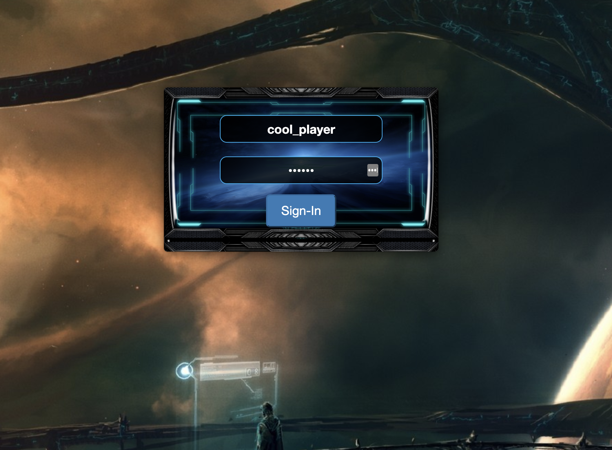
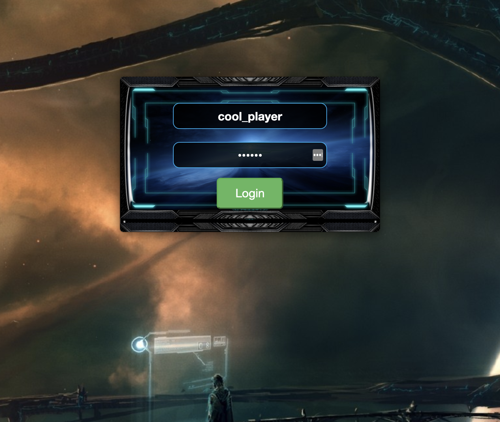
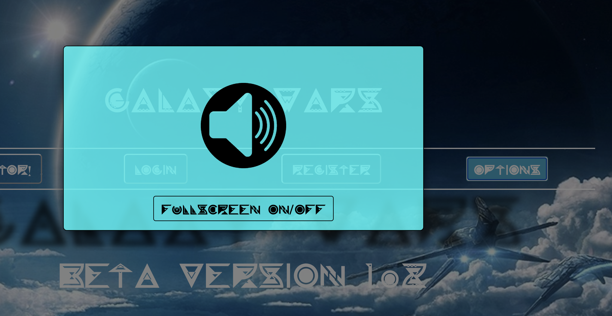
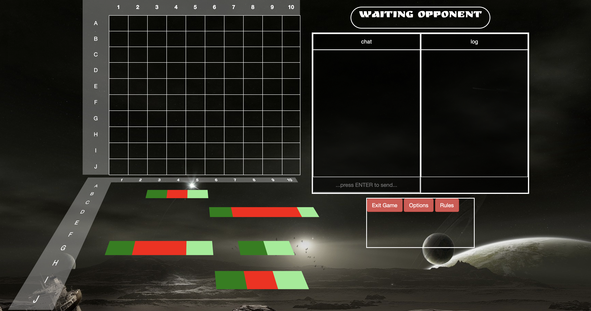
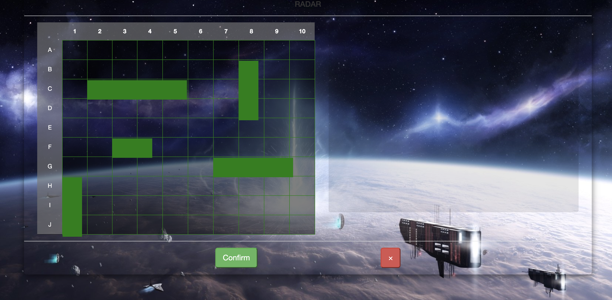

<!-- PROJECT SHIELDS -->
<!--
*** I'm using markdown "reference style" links for readability.
*** Reference links are enclosed in brackets [ ] instead of parentheses ( ).
*** See the bottom of this document for the declaration of the reference variables
*** for contributors-url, forks-url, etc. This is an optional, concise syntax you may use.
*** https://www.markdownguide.org/basic-syntax/#reference-style-links
-->
[![Contributors][contributors-shield]][contributors-url]
[![Forks][forks-shield]][forks-url]
[![Stargazers][stars-shield]][stars-url]
[![Issues][issues-shield]][issues-url]
[![MIT License][license-shield]][license-url]
[![LinkedIn][linkedin-shield]][linkedin-url]

<!-- PROJECT LOGO -->
 

  

  <h3 align="center">battleship</h3>

  

    Online multiplayer battleship game with space atmosphere. 
     
    <a href="https://ancient-headland-19532.herokuapp.com/web/games.html"><strong>Play now »</strong></a>
     
     
    <a href="https://github.com/victorgreco/battleship">View Demo</a>
    ·
    <a href="https://github.com/victorgreco/battleship/issues">battleship Bug</a>
    ·
    <a href="https://github.com/victorgreco/battleship/issues">Request Feature</a>
  

<!-- TABLE OF CONTENTS -->
## Table of Contents

* [About the Project](#about-the-project)
* [Built With](#built-with)
* [Getting Started](#getting-started)
* [Roadmap](#roadmap)
* [Contributing](#contributing)
* [License](#license)
* [Contact](#contact)

<!-- ABOUT THE PROJECT -->
## About The Project

[![Battleship Screen Shot][product-screenshot]](https://ancient-headland-19532.herokuapp.com/web/games.html)

This project borns as a final project of my Java web developer Bootcamp. The idea was to create a multiplayer online game in real time.

### Built With

* [Spring Bot](https://spring.io/projects/spring-framework) - As a main Backend framework mostly to handle databases, login and security.
* [H2 DDBB](https://www.baeldung.com/spring-boot-h2-database) - Temporal database for testing purposes.
* [Gradle](https://gradle.org/) - As a dependency manager tool.
* [Java](https://www.java.com/es/) - As  main backend language to build REST-APIS and endpoints.
* [JavaScript + jQuery](https://jquery.com/) - To handle all the UX and user interaction with the game.
* [CSS + Bootstrap](https://getbootstrap.com/docs/4.5/getting-started/introduction/) - Used to create all the nice look & feel.
* [Heroku](https://www.heroku.com/) - As hosting and deploy tool.

<!-- GETTING STARTED -->
## Getting Started

Access to [battleship](https://ancient-headland-19532.herokuapp.com/web/games.html) game and register yourself with a valid email and password.

If you're already registered go to login button instead.

You can stop musing or change to full screen by clicking the options button

### Once you register or login you will see all the ongoing games:

### Being able to:

* Join and ongoing game as viewer
* Join other waiting players to start a game
* Create a new game
* Check the rankings

### start a game !

### place you spaceships !

### and take fun
* Chatting in real time
* Shooting 3 times per turn to your opponent's grid

<!-- ROADMAP -->
## Roadmap

See the [open issues](https://github.com/victorgreco/battleship/issues) for a list of proposed features (and known issues).

<!-- CONTRIBUTING -->
## Contributing

Contributions are what make the open source community such an amazing place to be learn, inspire, and create. Any contributions you make are **greatly appreciated**.

1. Fork the Project
2. Create your Feature Branch (`git checkout -b feature/AmazingFeature`)
3. Commit your Changes (`git commit -m 'Add some AmazingFeature'`)
4. Push to the Branch (`git push origin feature/AmazingFeature`)
5. Open a Pull Request

<!-- LICENSE -->
## License

Distributed under the MIT License. See `LICENSE` for more information.

<!-- CONTACT -->
## Contact

Victor Greco - [linkedin](https://www.linkedin.com/in/victor-greco/) - victorgreco263@gmail.com

Project Link: [https://github.com/victorgreco/battleship](https://github.com/victorgreco/battleship)

<!-- MARKDOWN LINKS & IMAGES -->
<!-- https://www.markdownguide.org/basic-syntax/#reference-style-links -->
[contributors-shield]: https://img.shields.io/github/contributors/victorgreco/battleship.svg?style=flat-square
[contributors-url]: https://github.com/victorgreco/battleship/graphs/contributors
[forks-shield]: https://img.shields.io/github/forks/victorgreco/battleship.svg?style=flat-square
[forks-url]: https://github.com/victorgreco/battleship/network/members
[stars-shield]: https://img.shields.io/github/stars/victorgreco/battleship.svg?style=flat-square
[stars-url]: https://github.com/victorgreco/battleship/stargazers
[issues-shield]: https://img.shields.io/github/issues/victorgreco/battleship.svg?style=flat-square
[issues-url]: https://github.com/victorgreco/battleship/issues
[license-shield]: https://img.shields.io/github/license/victorgreco/battleship.svg?style=flat-square
[license-url]: https://github.com/victorgreco/battleship/blob/master/LICENSE.txt
[linkedin-shield]: https://img.shields.io/badge/-LinkedIn-black.svg?style=flat-square&logo=linkedin&colorB=555
[linkedin-url]: https://www.linkedin.com/in/victor-greco/
[product-screenshot]: images/homepage.png
